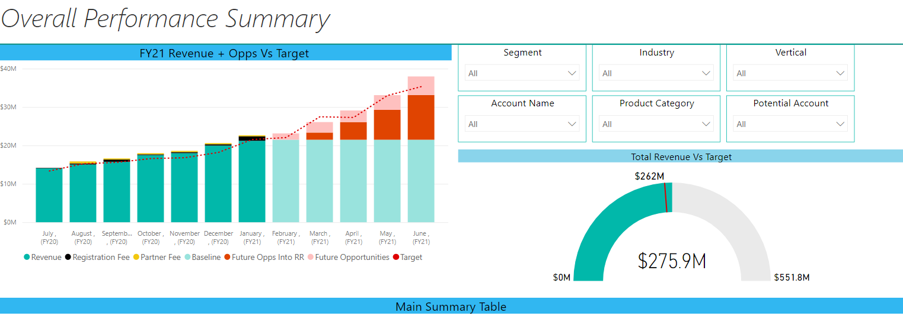
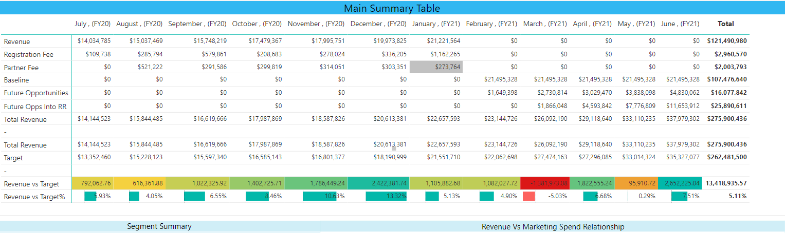
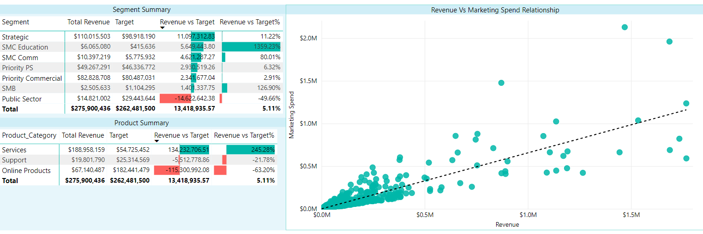
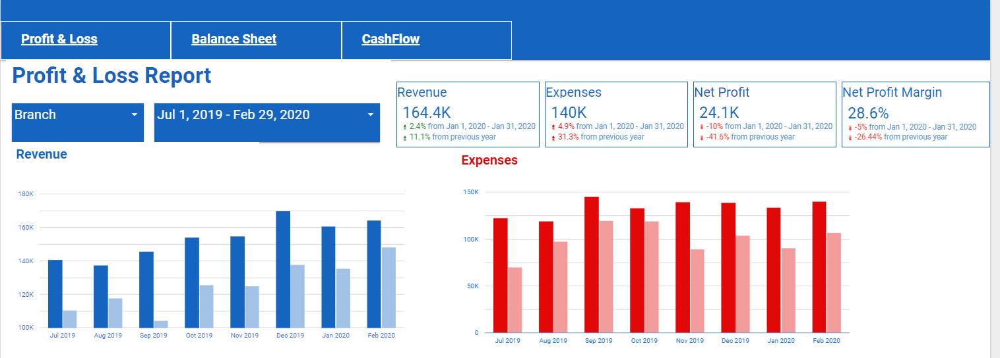
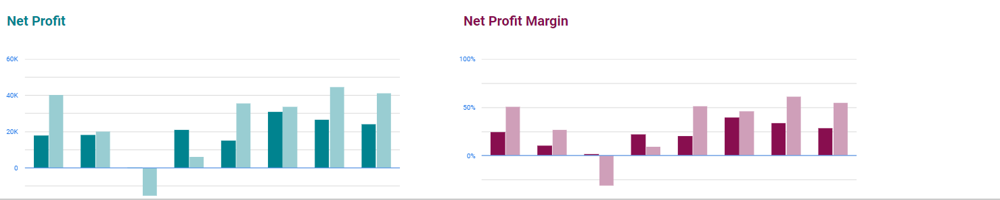
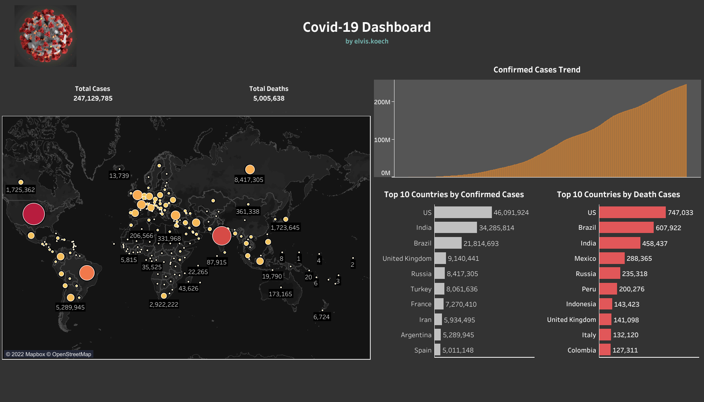
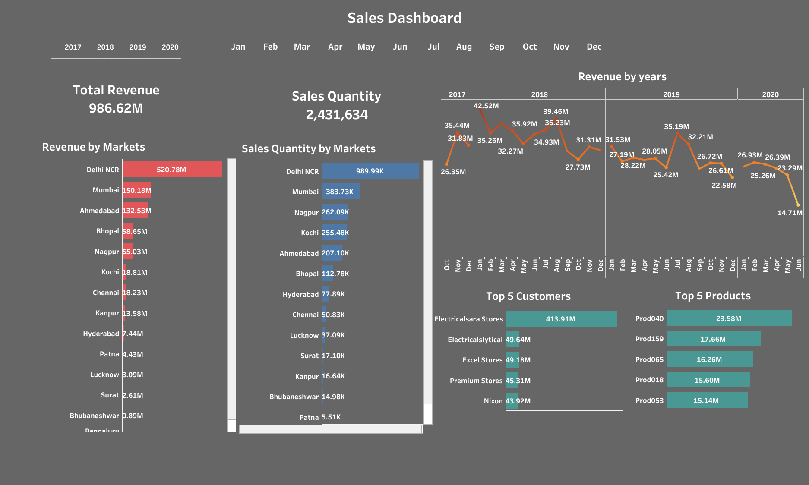

## Welcome to Elvis Koech Data Visualization Portfolio

[Project 1: Sales Dashboard Using Microsoft Power BI](https://i2.paste.pics/FVO36.png)

 + Designed an interactive Dashboard to visualize and track the current trend of Sales and Revenue as from Jan 2022.
 + Company Stakeholders were the main users i.e Financial Planning & Analysis Manager, Head of Commercial, Sales Manager.
 + Note: I used sample data.
 
 - 

[Project 2: Prepared Overall Company Performance for the year 2021 Using Microsoft Power BI](https://i2.paste.pics/FVO66.png)
 + Developed Company report for the year 2021 to analyze Company performance in different segements in the business.
 + Company Stakeholders were the main users i.e Financial Planning & Analysis Manager, Head of Commercial, Sales Manager.
 
 - 
 - 
 - 

[Project 3: Visualized Profit & Loss Report for the Finance Department Using Data Studio](https://i2.paste.pics/FVO8V.png)
 + Prepared Data Visualization for the Finance department.
 + Company Stakeholders and Finance Department were the main users 
 
 - 
 - 

[Project 4: Prepared Covid-19 Dashboard Using Tableau](https://public.tableau.com/app/profile/elvis.koech/viz/Covid-19DashboardwithTableau/Covid-19Dashboard)
 + Prepared Covid-19 Dashboard to track the Covid Cases and Deaths per country as from Feb 2020 to November 2021.
 + The General Public were the main users 
 
 - 
   
[Project 6: Visualized HR attrition](https://i2.paste.pics/FVO8V.png)
 + This is an overview of employee turnover rates within an organization. It includes metrics such as total headcount, attrition rate, voluntary vs. involuntary attrition, average tenure, and cost of attrition. + 
 + The dashboard allows HR teams to track turnover rates in specific departments or teams, identify areas of concern, and develop targeted retention strategies.
 + By providing data-driven insights into employee turnover, an HR attrition dashboard enables HR teams to make informed decisions to retain and engage their workforce. 
 
 - 

 
 
 
 

[Project 5: Created Sales Performance Dashboard Using Tableau](https://public.tableau.com/app/profile/elvis.koech/viz/SalesReport_16361402237660/Dashboard1)
 + Created Sales Performance report to track company Key performance Indicators over the years
 + The General Public were the main users 
 
 - 

